**PCB** \
**2025-2** \
**Bases ecológicas y genómicas de la interacción organismo-ambiente.**

## Unidad 4
## Teoría y métodos de estudio de nicho ecológico

### Algunas definiciones:
**[Grinell (1917):](https://sora.unm.edu/sites/default/files/journals/auk/v034n04/p0427-p0433.pdf)** 
La distribución de un taxón está limitada a un conjunto de ambientes y hábitats a los que su comportamiento y morfología están mejor adaptados.

***Toxostoma redivivum***
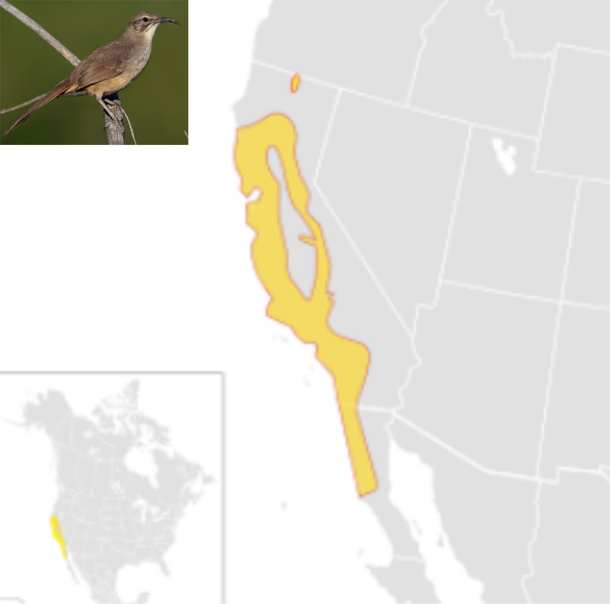

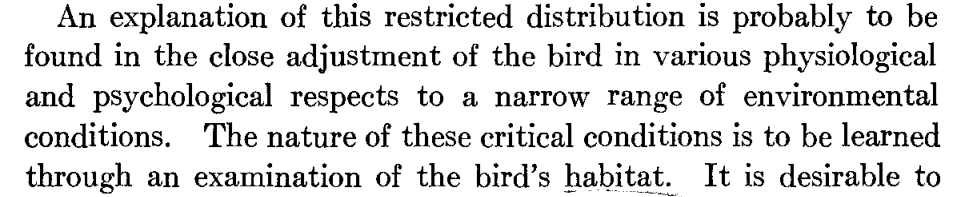

**[Charles Elton (1927):](https://www.biodiversitylibrary.org/item/31642#page/69/mode/1up)**  El nicho debe describir lo que hace un animal en su comunidad, sus interacciones bióticas, los recursos que consume, su relación con el medio y como lo modifica. Por ejemplo, equivalentes ecológicos.

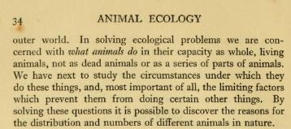

**[George Hutchinson (1957):](https://www2.unil.ch/biomapper/Download/Hutchinson-CSHSymQunBio-1957.pdf)** Define el nicho como la suma de todos los factores ambientales que actúan sobre un organismo. Entonces el nicho puede ser definido como una región en un hiperespecio de n-dimensiones. 
El concepto de nicho de Hutchinson a diferencia del de Grinnell y Elton define el nicho como una propiedad de la especie en lugar de una propiedad de la comunidad (Schoener 1989). 

**La dualidad de Hutchinson**
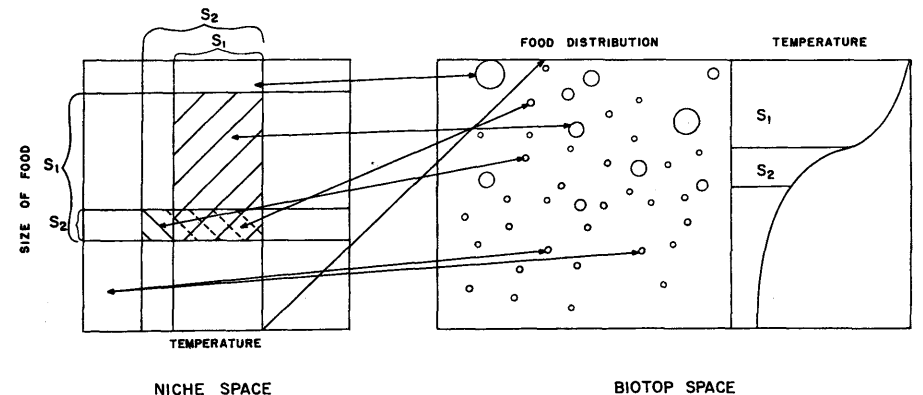
Dos nichos fundamentales definidos por un par de variables en un espacio de nicho bidimensional.  \
Solo una especie puede persistir en la región de intersección del subconjunto. \
Las líneas que unen puntos equivalentes en el espacio de nicho y el espacio de biotopo indican la relación entre los dos espacios. \
La distribución de las dos especies involucradas se muestra en el panel derecho con una curva de temperatura en profundidad.

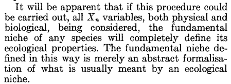

**Conclusión:** Cuando hablamos de **nicho** tenemos que tener en cuenta la definición que estamos siguiendo, porque como vimos, nicho puede significar predominancia de las interacciones bióticas, o  su ausencia y énfasis en las condiciones abióticas.

**Lectura recomendada** \
[Niche theory and its relation to morphology and phenotype in geographic space: a case study in woodpeckers (Picidae; Cooper 2018).](https://nsojournals.onlinelibrary.wiley.com/doi/abs/10.1111/jav.01771)

## 4.1 Función de las especies
Algunas dimensiones del nicho de una especie representan funciones o servicios del ecosistema, como la polinización (**nichos funcionales**). Por tanto, la riqueza de especies podría estar relacionada con la función del ecosistema. 

**Riqueza y función del ecosistema**
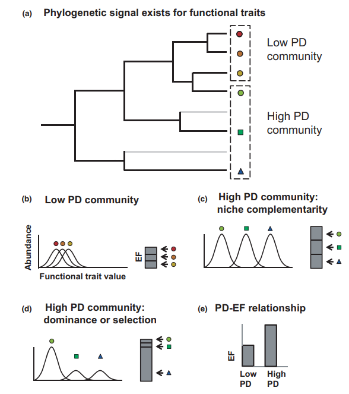
Considera una comunidad: \
(a) Las especies estrechamente relacionadas son más similares funcionalmente que las especies distantes. \
(b) Baja diversidad filogenética: incluirá especies con un alto solapamiento en los rasgos funcionales, lo que podría generar una fuerte competencia interespecífica que limite las abundancias, y como consecuencia, bajas funciones ecosistémicas. \
(c) Una comunidad con alta DF incluirá especies con menor solapamiento en los rasgos funcionales, lo que podría aumentar la contribución de todas las especies a las funciones ecosistémicas a través de la complementariedad de nichos. \
(d) Aumenta la probabilidad de incluir una especie dominante con un rasgo funcionalmente importante. \
(e) Esto resulta en una correlación positiva entre la DF y las FE.

[Phylogenetic diversity and the functioning of ecosystems (Srivastava et al., 2012).](https://onlinelibrary.wiley.com/doi/10.1111/j.1461-0248.2012.01795.x) 

Aumentar la riqueza de especies otorga estabilidad a las funciones ecosistémicas, es decir, la varianza de una función ecosistémica promedio disminuye en las mediciones a lo largo del tiempo o el espacio a medida que aumenta la biodiversidad.

**Relación entre riqueza de especies y función ecosistémica**
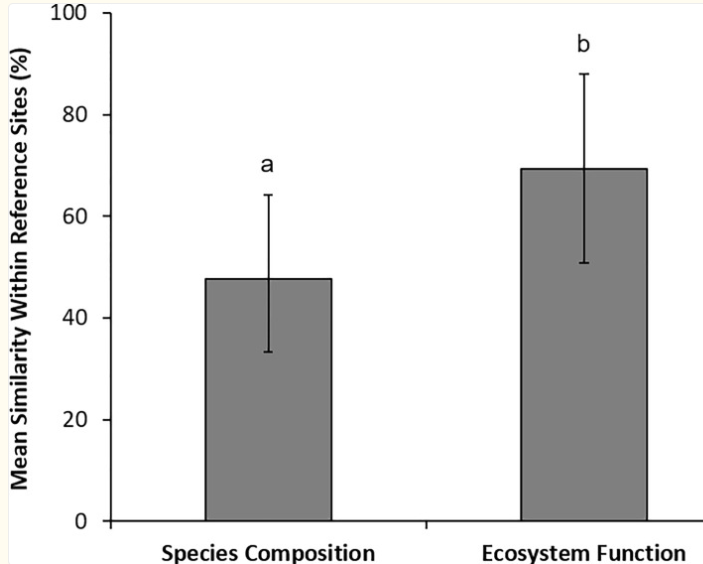
Los ecosistemas son más variables en términos de composición de especies que en función ecosistémica.

**Ejemplos de función ecosistémica**
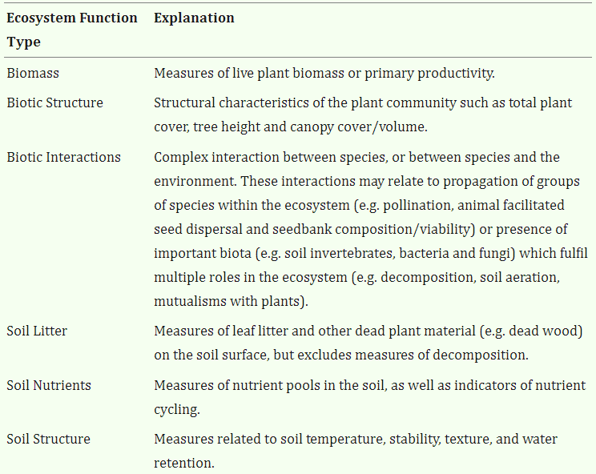

[The species composition-ecosystem function relationship: A global meta-analysis using data from intact and recovering ecosystems (Carrick & Forsythe 2020)](https://pmc.ncbi.nlm.nih.gov/articles/PMC7392319/).

La teoría ecológica postula que una mayor riqueza de especies debería estar asociada con una mayor explotación de recursos y un *Niche-packing* que resulta de un aumento en el solapamiento de nichos entre especies o en la especialización de los nichos de las especies.

- **Especialización**: El estrechamiento del nicho de cada especie coexistente. Relacionado con la la **amplitud del nicho ecológico**. 
- **Complementariedad**: Múltiples especies que utilizan los mismos recursos, lo que resulta en un mayor solapamiento de nichos. Relacionado con **diferenciación del nicho**.

*Niche-packing hypothesis* (MacArthur, 1965): Las especies pueden coexistir en comunidades diversas al modificar la amplitud de su nicho a través de dos mecanismos no exclusivos:

- Una mayor disponibilidad de recursos y heterogeneidad puede conducir a una mayor riqueza y resultar en la expansión del espacio de nicho de la comunidad, ya que las especies explotan recursos no aprovechados.

- El estrechamiento del nicho de cada especie que coexiste (especialización) o el uso de los mismos recursos por múltiples especies, lo que resulta en una mayor superposición de nichos (por ejemplo, grupos funcionales).

**Diagrama conceptual con tres hipótesis** 
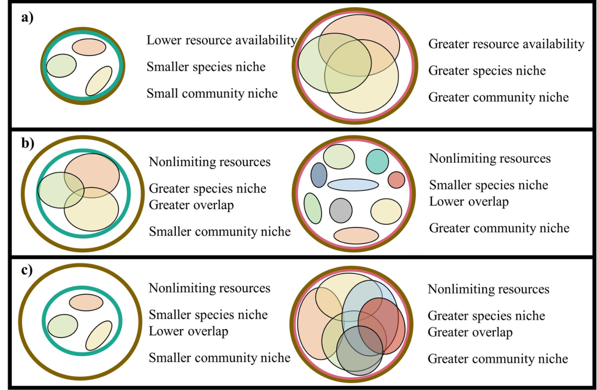
Los círculos marrones representan la disponibilidad de recursos, los círculos verdes y rojos representan un gradiente del tamaño del nicho de la comunidad, y las elipses representan los nichos de las especies. \
(a) El nicho trófico de la comunidad y de las especies aumenta con una mayor disponibilidad y heterogeneidad de los recursos (e.g., alimento). \
(b) El nicho trófico de las especies disminuye a través de la especialización, mientras que el nicho de la comunidad aumenta a medida que la riqueza taxonómica es mayor. \
(c) Tanto el nicho de las especies como el de la comunidad aumentan con la riqueza. 

[Niche specialization and community niche space increase with species richness in filter-feeder assemblages (Sánchez-González  et al., 2016).](https://esajournals.onlinelibrary.wiley.com/doi/10.1002/ecs2.4495)

Mientras que el concepto de nicho ecológico incluye diversos factores abióticos y bióticos en un espacio multidimensional, varias dimensiones del nicho representan procesos bióticos importantes y, por lo tanto, funciones ecosistémicas, resaltadas en los términos **nicho funcional** y **complementariedad funcional del nicho**.

**La diferenciación de nichos ecológicos es conocida por promover la biodiversidad** 
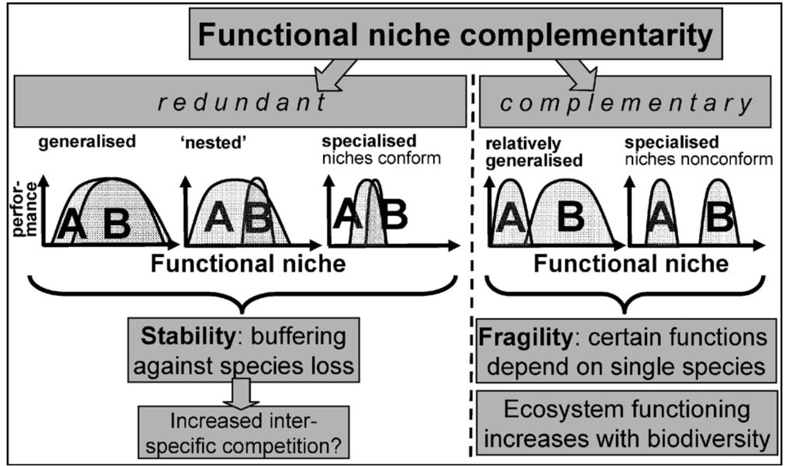
- La redundancia funcional en una comunidad implica que las especies son mutuamente sustituibles en términos de una función ecológica. 
- La redundancia puede mejorar la estabilidad de una comunidad, pero también puede aumentar la competencia interespecífica cuando la función objetivo representa un recurso limitado. 
- La complementariedad describe que las especies son funcionalmente diferentes, lo que requiere que los nichos sean relativamente estrechos.
- Cuando hay complementariedad de nicho, la competencia interespecífica se reduce, facilitando su coexistencia. 

**Complementariedad de nicho en interacciones multiespecies**
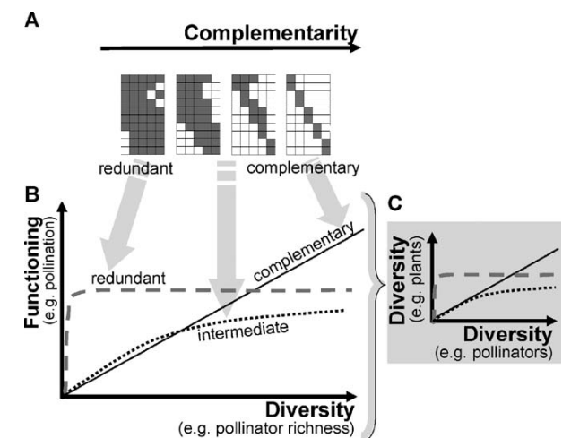

A) Una matriz con especies de polinizadores en las filas, especies de plantas en las columnas y las interacciones realizadas como celdas grises. La especialización complementaria aumenta de izquierda a derecha. \
(B) La forma de la relación biodiversidad-funcionamiento depende de la extensión de la complementariedad funcional (redundante, intermedia o complementaria). \
(C) Paralelamente a una mejora del funcionamiento a escala comunitaria, la diversidad del receptor puede aumentar con una mayor diversidad del transmisor de la función.

[Functional complementarity and specialisation: The role of biodiversity in plant–pollinator interactions (Blüthgen & Klein 2011).](https://www.sciencedirect.com/science/article/abs/pii/S1439179110001350?via%3Dihub)

**Práctica 4.1: Interacciones entre plantas y polinizadores.** \
Estimar diferentes estadísticos sobre la complementaridad y redundancia del nicho. \
Para la práctica seguiremos el tutorial de [Sofía Pastor Parajeles](https://rpubs.com/sofiapastor/500655) usando el paquete [Bipartite en R](https://cran.r-project.org/web/packages/bipartite/bipartite.pdf).

**Recomendaciones:** 
- [Niche complementarity among plants and animals can alter the biodiversity–ecosystem functioning relationship (Amyntas et al 2023).](https://besjournals.onlinelibrary.wiley.com/doi/full/10.1111/1365-2435.14419)
- [Functional Structure and Patterns of Specialization in Plant-Pollinator Relationships of an Agroecosystem in Valle del Cauca, Colombia (Aguado et al 2023).](http://www.scielo.org.co/scielo.php?script=sci_arttext&pid=S0120-548X2019000200331)

## 4.2 Preferencias ambientales
Las características de las especies determinan el rango de condiciones ambientales en las que cada especie puede ocurrir, y se espera que las abundancias alcancen su máximo cuando las características coinciden mejor con las condiciones ambientales (Heino & Grönroos, 2014).

Esto sugiere que podría haber un conjunto de características que permitan predecir qué especies deberían ser dominantes y ampliamente distribuidas.

Diferencias en los rasgos determinan las capacidades de las especies para explotar ya sea hábitats comunes (**posición del nicho**) o una variedad de hábitats (**amplitud del nicho**) y la posición y amplitud del nicho, a su vez, afectan la abundancia y la ocupación.

#### La hipótesis de la amplitud del nicho [(Brown, 1984):](https://www.jstor.org/stable/2461494) 

**Requerimientos:**
1) La abundancia y distribución de cada especie está determinada por combinaciones de muchas variables físicas y bióticas que son necesarias para la supervivencia y reproducción de sus individuos (Hutchinson 1957).
2) La variación ambiental también está autocorrelacionada, de modo que la probabilidad de que los sitios tengan combinaciones similares de variables ambientales es una función inversa de la distancia entre ellos.
3) Las especies estrechamente relacionadas y ecológicamente similares difieren en una o muy pocas dimensiones del nicho.

**Planteamientos**
- La densidad poblacional debería ser más alta cerca del centro del área de distribución de una especie y debería disminuir hacia los límites.

- Para cada especie, debería haber un sitio más favorable donde la densidad poblacional sea más alta, porque la combinación de variables ambientales corresponde más estrechamente a los requisitos de la especie.

- Si la variación espacial en el ambiente está autocorrelacionada, entonces, con el aumento de la distancia desde este sitio, el ambiente se hará progresivamente más diferente, los requisitos del nicho de la especie se cumplirán con menos frecuencia y la abundancia disminuirá. 

**Amplitud del nicho**
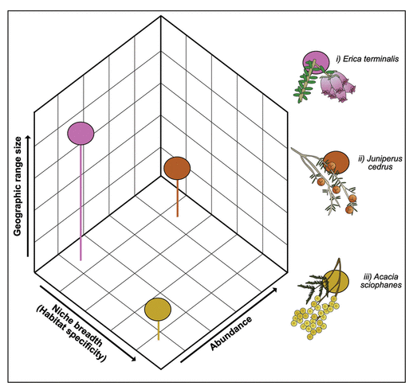 \
1) Especies con un *NB* estrecho y baja abundancia local pero un gran tamaño de rango geográfico.
2) Especies con un *NB* estrecho y un rango geográfico pequeño pero alta abundancia.  
3) Especies con un *NB* amplio pero un rango geográfico y abundancia pequeños.

#### La hipótesis de la posición del nicho 
También llamada la hipótesis de la disponibilidad de hábitat [(Venier & Fahrig 1996)](https://www.jstor.org/stable/2461494:) sostiene que las especies capaces de utilizar las condiciones ambientales más comunes que se encuentran a través de los hábitats en una región (es decir, una posición central en el nicho) serán tanto locales abundantes como de amplia distribución.

**Distribución y disponibilidad de hábitat**
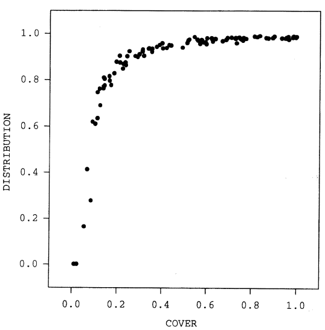 \
Distribución (medida como la proporción de celdas de hábitat de cría ocupadas) graficada contra COVER (proporción del área total del paisaje en hábitat de cría) para 100 simulaciones.

**Abundancia y disponibilidad de hábitat**
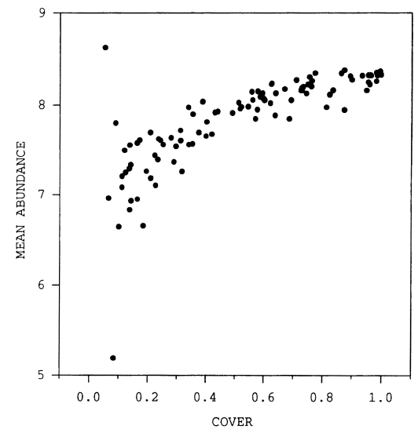 \
**Planteamientos de la teoría**  \
Correlación positiva entre:  \
(1) la abundancia y el número de celdas de hábitat de cría en el paisaje de simulación.  \
(2) la distribución y el número de celdas de hábitat de cría en el paisaje.  \
(3) La abundancia y la distribución.

**Hipótesis de las relaciones entre la rasgos, la amplitud del nicho, la posición del nicho, la abundancia y la ocupación.**
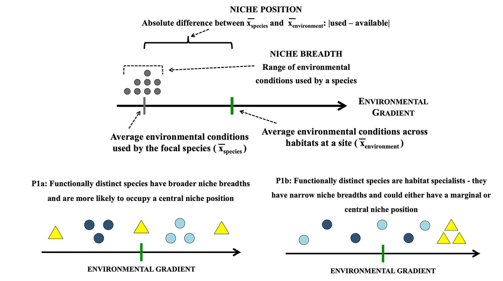

- Se espera que las especies funcionalmente distintas tengan amplitudes de nicho más amplias y vivan en las condiciones ambientales más comunes encontradas a través de los hábitats (es decir, tengan una posición central en el nicho; Figura 1, P1a). 

- Alternativamente, puede ser que combinaciones de rasgos muy distintas restrinjan el rango de condiciones ambientales de una especie y representen una estrategia ecológica adecuada para un especialista en hábitat; de ser así, las especies funcionalmente distintas tendrían amplitudes de nicho estrechas y podrían ocupar hábitats centrales o marginales (Figura 1, P1b). 

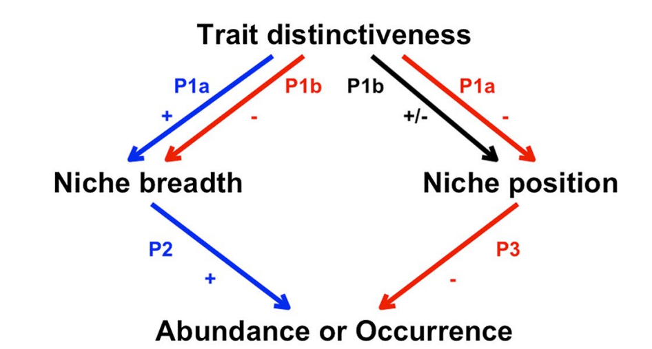
- Según las hipótesis de amplitud del nicho y posición del nicho, las species funcionalmente distintas tendrán amplitudes de nicho más amplias y estarán en las condiciones ambientales más comunes encontradas esto llevaría a altas abundancias y registros frecuentes de tales especies (Figura 1, panel inferior, P2).

- Combinaciones de rasgos muy distintas restrinjan el rango de condiciones ambientales de una especie y representen una estrategia ecológica adecuada para un especialista en hábitat. A través de la hipótesis de amplitud del nicho, se espera que tal especialización en hábitat conduzca a una baja abundancia local y una presencia poco frecuente (Figura 1, panel inferior, P3).

[Species niches, not traits, determine abundance and occupancy patterns: A multi‐site synthesis (Marino et al 2019).](https://onlinelibrary.wiley.com/doi/abs/10.1111/geb.13029)

"The trait distinctiveness of each species was unrelated to its niche properties, abundance and occupancy. In contrast, niche position was the main predictor of
abundance and occupancy; species that used the most common environmental conditions were locally abundant and widespread" [(Marino et al 2019).](https://onlinelibrary.wiley.com/doi/abs/10.1111/geb.13029)

**Consideraciones**
- No existe una sola característica que pueda describir completamente las estrategias ecológicas utilizadas por una especie.
- Los patrones de abundancia y ocupación pueden estar determinados por combinaciones de varias características en lugar de por características individuales (por ejemplo, el tamaño corporal y el gremio trófico.
- La distinción de cada especie en términos de composición de características en comparación con el resto de la comunidad puede ser un factor clave.

**Artículo de discusión 1:** \
[Niche Breadth: Causes and Consequences for Ecology, Evolution, and Conservation (Carscadden et al., 2020.)](https://www.journals.uchicago.edu/doi/10.1086/710388)

**Práctica 4.2: Algunas propiedades del nicho.** \
Estimar la posición y la amplitud del nicho para un set de espcies. \
Para la práctica seguiremos el tutorial de [(KarasiewiczStephane/WitOMI).](https://github.com/KarasiewiczStephane/WitOMI) \
Más información en [Within outlying mean indexes: refining the OMI analysis for the realized niche decomposition (Karasiewicz et al., 2017).](https://pmc.ncbi.nlm.nih.gov/articles/PMC5444369/)

**Parte 2: Análisis de Correspondencia Canónica.** \
También exploraremos las correlaciones entre el conjuntos de variables ambientales y el conjunto de variables dependientes (presencia de las especies).

Para la práctica seguiremos el tutorial de [(KarasiewiczStephane/WitOMI).](https://github.com/KarasiewiczStephane/WitOMI) \
Otro [tutorial de perrygeo](https://gist.github.com/perrygeo/7572735) usando el paquete [vegan.](https://cran.r-project.org/package=vegan) 

**Más información acerca de estos análisis en R** 
- [Analysis of Ecological Data: Exploratory and Euclidean Methods in Environmental Sciences (ade4).](https://adeverse.github.io/ade4/) 
- [ade4: Analysis of Ecological Data : Exploratory and Euclidean Methods in Environmental Sciences.](https://rdrr.io/rforge/ade4/man/niche.html) 
- [The adegraphics package (Julien-Laferrière et al., 2023).](https://cran.r-project.org/web/packages/adegraphics/vignettes/adegraphics.html) 
- [Multivariate Analysis of Ecological
Communities in R: vegan tutorial
(Oksanen 2015).](https://john-quensen.com/wp-content/uploads/2018/10/Oksanen-Jari-vegantutor.pdf)

**Recomendaciones** 
- [Niche position and niche breadth effects on population abundances: A case study of New World Warblers (Parulidae; Castaño‐Quintero et al., 2024).](https://pmc.ncbi.nlm.nih.gov/articles/PMC10944703/)
- [Estimates of niche position and breadth vary across spatial
scales for native and alien inland fishes (Cano-Barbacil et al., 2022).](https://invasiber.org/GarciaBerthou/docs/papers/Cano‐Barbacil_GEB_2022_withSI.pdf)
- [Modelling the ecological niche from functional traits (Kearney et al 2010).](https://pmc.ncbi.nlm.nih.gov/articles/PMC2981966/#RSTB20100034C37)
 

## 4.3 Cambios en el hábitat
Los cambios en las condiciones abióticas son inevitables.

Cambios ambientales antropogénicos: al aceleramiento del cambio climático, la deforestación, la urbanización, la degradación del suelo y la contaminación.  

Las áreas que antes formaban parte del rango de una especie pueden volverse desfavorables y nuevas áreas pueden volverse adecuadas. Por lo tanto, se espera que los rangos de las especies se desplacen en respuesta a los cambios globales, reorganizando la biodiversidad del planeta. Muchas especies ya han extendido sus rangos tanto latitudinal como longitudinalmente.

**Artículo de discusión 2:** \
[Accessible areas in ecological niche comparisons of invasive species: Recognized but still overlooked (Qiao et al., 2017)](https://www.nature.com/articles/s41598-017-01313-2). El cuál es una reinterpretación de [Febbraro et al., 2012,](https://journals.plos.org/plosone/article/file?id=10.1371/journal.pone.0066559&type=printable) quienes hacen un análisis del caso de invasión de la ardilla gris en las Islas Británicas. 

**A qué escala temporal operan los cambios en el nicho?** \
La mayoría de estudios se centran en una sola especie. \
**Qué alternativas se les ocurren?**
Las especies introducidas proporcionan un 'experimento semi-natural' en el que se enfrentan a condiciones ambientales novedosas.

**Representación del nicho**
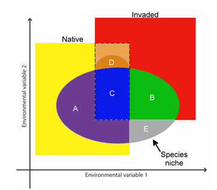 \
Framework of species’ ecological niches across accessible areas in native (yellow) and invaded (red) 
ranges. \
**Portions of the niche are as follow:** \
(A) native-range environments (purple): species using environments available only in the native range. \
(B) invaded environments (green): species using environments available only in the invaded range. \
(C) overlapping environments (dashed line): invaded-range populations using the same environments as in the native range (blue). \
(D) overlapping environments: species using novel environments 
in the invaded range (i.e., not used in the native range, even when available; dark orange).\
(E) Environments not available in either native or invaded ranges (=the unfilled niche). Similar environments available in both, the native and invaded ranges are indicated with a dashed line. \
**Cuál es el nicho fundamental?** 

**Mecanismos de cambio del nicho realizado.**
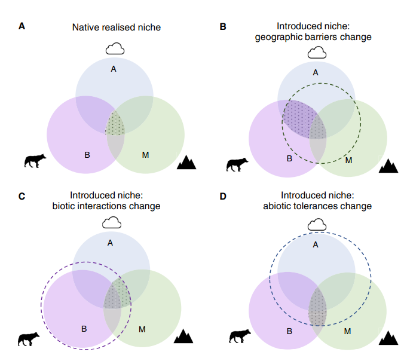
(A) El nicho realizado del rango nativo de una especie. \
(B) Un cambio de nicho en el que los cambios en las restricciones sobre el movimiento de una especie han permitido alcanzar una mayor sección del nicho biótico y abiótico. \
(C) Un cambio de nicho en el que los cambios en las restricciones bióticas sobre una especie han permitido alcanzar una mayor sección del nicho de movimiento y abiótico. \
(D) Un cambio de nicho en el que los límites abióticos de la especie han cambiado.

**Cambios en el nicho**
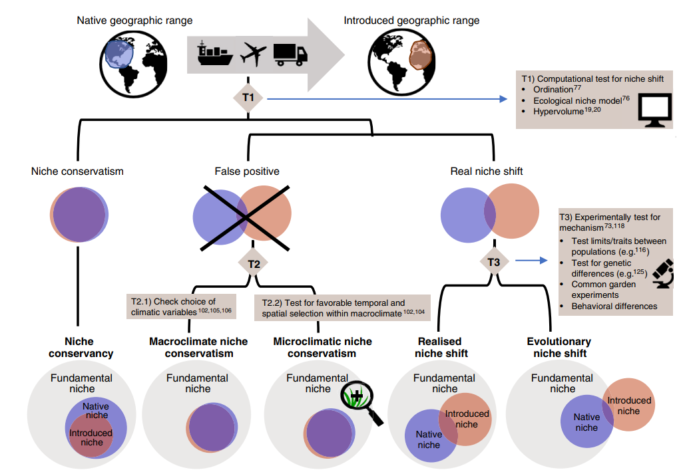
**T1:** Al producirse una expansión geográfica de una especie, primero se debe determinar si el nuevo nicho es un caso de conservadurismo del nicho o si ha ocurrido un cambio de nicho. \
**T2:** Falsos positivos pueden ocurrir porque no ha habido un cambio en el clima experimentado por la población introducida: 
- Porque las variables climáticas medidas no son biológicamente significativas (conservadurismo del nicho macroclimático). 
- El microclima experimentado por la especie es consistente con su nicho original (conservadurismo del microclima). 

**T3:** Un verdadero cambio de nicho puede determinarse experimentalmente. 
- En algunos casos, el nuevo nicho resultará ser parte del nicho fundamental de la especie, en cuyo caso el cambio se denomina ‘cambio del nicho realizado’.  
- En otros casos, se han producido cambios evolutivos en la población que permiten la supervivencia de la especie en el nuevo nicho (cambio evolutivo del nicho).

**Qué dicen los datos empíricos?**
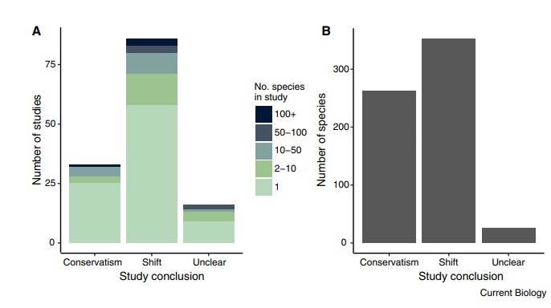

### Transferencias en tiempo y Espacio
**La dualidad de Hutchinson**

La imagen fue tomada de Soberón et al., 2017. [Click aquí para ver la imagen y la nota en Revista Mexicana de Biodiversidad.](https://www.redalyc.org/journal/425/42551127018/html/)

Aquí otro ejemplo.

Como se distribuyen en el espacio geográfico algunos de los principales biomas presentes en el continente Americano. 

Como se distribuyen esos mismos biomas en el espacio ambiental con base en los dos primeros componentes de un análisis de PCA.

**Desplazamientos en el nicho y la anisotropía del espacio ambiental**

Está claro que el mismo nicho fundamental NF, expresado en diferentes regiones con espacios ambientales correspondientemente distintos E' y E'', producirá distintos nichos fundamentales existentes y, por lo tanto, con alta probabilidad, diferentes NR, incluso en ausencia de competidores y procesos evolutivos.

**Anisotropía del espacio ambiental**
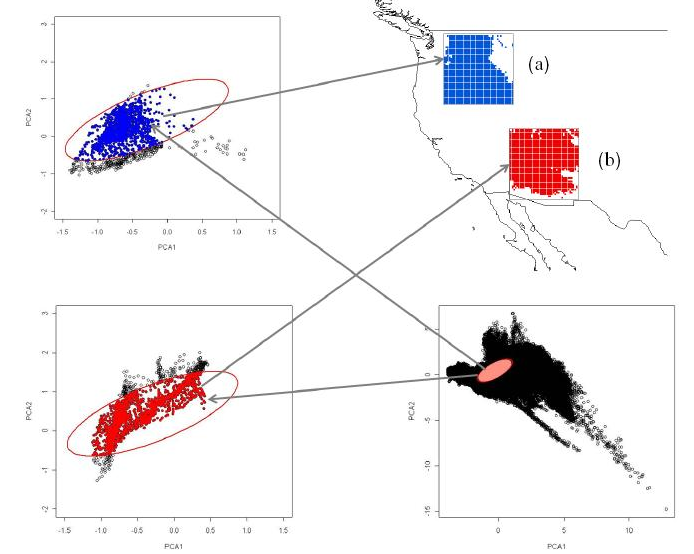
Los puntos de ocurrencia que caen en **N**\**F* de la especie en las regiones norte y sur en el mapa se muestran en azul y rojo, respectivamente. \
A pesar de una amplia superposición general, las combinaciones climáticas correspondientes a los dos rangos son diferentes, y una especie capaz de alcanzar cada celda de la cuadrícula tendría diferente **N**\**F* (y por lo tanto, nicho realizado) en las regiones norte y sur. \
Este resultado se mantiene incluso asumiendo: (i) **N***F* constante, (ii) ausencia de competidores o interactores de cualquier tipo, y (iii) equilibrio total de dispersión dentro de cada subregión.

[Ecological niche shifts and environmental space anisotropy: a cautionary note (Soberón & Peterson 2011)](https://www.scielo.org.mx/scielo.php?script=sci_arttext&pid=S1870-34532011000400032).

**Práctica 4.3:** Espacio geográfico y espacio ambiental.\
Los materiales necesarios para replicar las imágenes de los biomas de América en el espacio geográfico y ecológico se encuentran en la carpeta **practica3_espacio_ecol_and_geog**. 

**Ejercicio** \
Haz un ejercicio similar para una región de tu interés.

### Modelos de Nicho Ecológico 
 **Tarea:** \
Busca una breve deficición de los sigueintes conceptos referente a su aplicación en modelos:

##### Modelo:
##### Parametrización:
##### Ajuste: 
##### Selección:
##### Robustez:
##### Sensibilidad:

#### Breve discusión sobre "El arte de modelar"

Una excelente guía de para los que desean trabajar con modelos de nicho ecológico: [Want to model a species niche? A step-by-step guideline on correlative ecological niche modelling (Sillero et al., 2021)](https://www.sciencedirect.com/science/article/abs/pii/S0304380021002301).

**Práctica 4.4:** Transferencias en tiempo y espacio. \
Vamos a emplear un enfoque de MNE basado en elipses.
Esta práctica está basada en:
-  [ellipsenm (Marlon Cobos et al 2019)](https://github.com/marlonecobos/ellipsenm).
- [NicheToolBox (Osorio-Olvera et al 2019)](https://github.com/luismurao/ntbox).
- [ntbox (Osorio-Olvera et al 2019)](https://luismurao.github.io/ntbox_user_guide.html).

#### **Recomendaciones**
**Referencias** 
- [The role of climate change and niche shifts in divergent range dynamics of a sister-species pair (Summers et al., 2023)](https://peercommunityjournal.org/item/10.24072/pcjournal.248.pdf). 
- [Most invasive species largely conserve their climatic niche (Aravind et al., 2022)](https://www.pnas.org/doi/10.1073/pnas.2004289117). 
- [Niche shift in invasive species: is it a case of “home away from home” or finding a “new home”? (Liu et al., 2020)](https://link.springer.com/article/10.1007/s10531-022-02447-0#:~:text=However%2C%20if%20there%20is%20evidence,new%20home%2C%20an%20alien%20home.). 
- [Climatic niche shifts in introduced species (Bates & Bertelsmeier 2021).](https://www.cell.com/current-biology/pdf/S0960-9822(21)01139-8.pdf) 
- [Ecological Niche Shifts Affect the Potential Invasive Risk of Rapistrum rugosum (L.) All. in China (Xian et al 2022).](https://www.frontiersin.org/journals/plant-science/articles/10.3389/fpls.2022.827497/full) 

**Cursos** \
Carga teórica y práctica novedosa \
INECOL - Dr. Andrés Lira et al. \
Mérida - Dr. Carlos Yanes et al. \
Analisis espacial - Dr. David Prieto et al. \
YouTube - Dr. AT. Peterson et al. 

## 4.4 Conservadurismo de nicho
Es la tendencia que especies relacionadas presenten nichos similares (fundamental o realizado; [Pearman et al., 2008](https://pubmed.ncbi.nlm.nih.gov/18289716/)).

**Origen evolutivo y consecuencias ecológicas del conservadurismo de nicho filogenético** 
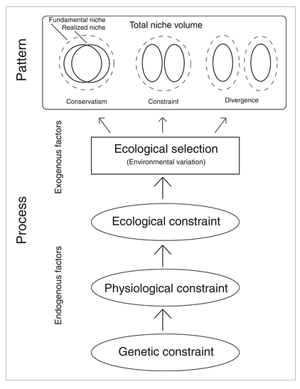
Factores endógenos de restricción sobre los fenotipos hasta los factores exógenos de selección ecológica. \
Esto conduce a los patrones principales del CFN, incluyendo conservadurismo, restricción y divergencia de nichos entre especies.

#### Conservadurismo de nicho como patrón
En el contexto de la especiación, el CFN actúa sobre las poblaciones locales para producir múltiples especies. La población local es, por lo tanto, la unidad fundamental del CNP para la especiación, pero el impacto del CNP es crucial para interpretar los patrones subsecuentes de ensamblaje de comunidades, diversidad regional y biogeografía a niveles más altos a lo largo de la filogenia.

**Conservadurismo de nicho como patrón**\

#### Conservadurismo de nicho como proceso
El CFN como proceso puede llevar potencialmente a la divergencia de nichos en hábitats heterogéneos o en rápida transformación, ya que las poblaciones se desplazan en lugar de adaptarse. El CFN provoca que las poblaciones se separen alopátricamente. Si las poblaciones se adaptan total o parcialmente a los entornos cambiantes, la separación geográfica se minimizaría y la selección para la especiación ecológica se reduciría.

**Conservadurismo de nicho como proceso:**

**(a):** \
**(b):** \
**(c):** \
**(d):** \
**(e):** \
**(f):** 

El CFN como proceso (retención instantánea de nichos) podría promover la especiación (CFN como patrón), resultando ya sea en divergencia de nichos o en conservadurismo de nichos.

**Factores que pueden influir en la especiación a través del CFN**
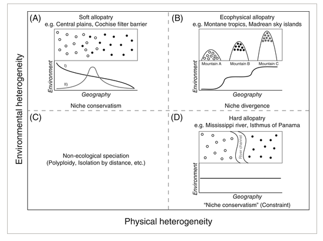
 Los eventos de especiación que ocurren en diferentes puntos a lo largo de estos ejes pueden resultar en diferentes patrones como se describe arriba de los gráficos, incluyendo conservadurismo y difernciación. \
La **curva I** representa una variable ambiental que cambia lentamente de un valor alto a uno bajo, con poblaciones adaptadas a cada extremo encontrándose en el medio. \
La **curva II** representa dos áreas ecológicamente similares separadas por un valor intermedio más alto para una variable ambiental dada, con dos poblaciones igualmente adaptadas acercándose al borde de sus límites de rango en esa área. 

**Artículo de discusión 3:**\
[Phylogenetic niche conservatism and the evolutionary basis of ecological speciation (Pyron et al., 2014).](https://onlinelibrary.wiley.com/doi/10.1111/brv.12154)

**Aplicación en el filo-morfo espacio (Phylomorphospace)**
Un enfoque en el filo-morfo espacio nos permite considerar la filogenia, la disparidad y el tempo simultáneamente. [(Lloyd 2018)](https://onlinelibrary.wiley.com/doi/full/10.1111/pala.12380).

**Ejemplo con osos:**

Resultados del espacio filoclímatico para ocho especies actuales de la familia Ursidae. 
- El modelo conserva las relaciones entre las secuencias mitocondriales completas de las especies. 
- Posiciona cada punta del árbol en la combinación de precipitación y temperatura de su centroide ambiental.
- Muestra reconstrucciones lineales de las trayectorias ecológicas de los ancestros. 

[Bears into the Niche-Space: Phylogeography and Phyloclimatic Model of the Family Ursidae (Luna-Aranguré & Vázquez-Domínguez 2024).](https://www.mdpi.com/1424-2818/16/4/223)

**Práctica 4.5: Phylomorphospace** \
En esta práctica vamos a revisar algunos de los análisis presentados en [(Luna-Aranguré & Vázquez-Domínguez 2024).](https://www.mdpi.com/1424-2818/16/4/223)

Esta práctica está basada en:

- [nicheROVER-package (Stasko & Swanson 2013).](https://cran.r-project.org/web/packages/nicheROVER/nicheROVER.pdf) 
- [A new probabilistic method for quantifying n-dimensional ecological niches and niche overlap (Swanson et al., 2015).](https://esajournals.onlinelibrary.wiley.com/doi/10.1890/14-0235.1) 
- [An Ecologist’s Guide to nicheROVER: Niche Region and Niche Overlap Metrics for Multidimensional Ecological Niches (Lysy & Swanson 2013).](https://cran.r-project.org/web/packages/nicheROVER/vignettes/ecol-vignette.html) 
- [JOURNEYS THROUGH DISCRETE-CHARACTER
MORPHOSPACE: SYNTHESIZING PHYLOGENY,
TEMPO, AND DISPARITY (Lloyd 2018).](https://onlinelibrary.wiley.com/doi/pdf/10.1111/pala.12380) 
- [Phylomorphospaces with ggplot in R (Carlos-Barbacil
2022).](https://cano-barbacil.wixsite.com/canobarbacil/post/phylomorphospaces-with-ggplot-in-r) 
- [Phylogenetic Tools for Comparative Biology (Liam Revell, forever).](http://blog.phytools.org/2022/12/generating-ggplot-phylomorphospace-plot.html)

**Recomendaciones**
- Niche conservatism as an emerging principle in ecology and conservation biology
[(Wiens et al 2010).](https://onlinelibrary.wiley.com/doi/epdf/10.1111/j.1461-0248.2010.01515.x)
- Phylogenetic niche conservatism: what are the underlying evolutionary and ecological causes?
[(Crisp & Cook 2012).](https://nph.onlinelibrary.wiley.com/doi/10.1111/j.1469-8137.2012.04298.x)
- Phylogenetic niche conservatism – common pitfalls and ways forward
[(Münkemüller et al 2014).](https://besjournals.onlinelibrary.wiley.com/doi/10.1111/1365-2435.12388)

## 4.5 Modificaciones de las poblaciones
La distribución de la diversidad genética dentro y entre las poblaciones en relación con los rangos geográficos de las especies es fundamental para comprender los procesos de evolución, especiación y biogeografía.

**Procesos evolutivos en el conservadurismo de nicho y su relación con las áreas de distribución:**

[Phylogenetic niche conservatism and the evolutionary basis of ecological speciation (Pyron et al., 2014).](https://onlinelibrary.wiley.com/doi/10.1111/brv.12154)

A lo largo de los límites de distribución, las poblaciones pueden ser escasas, fragmentadas y propensas a la extinción local.\
También pueden representar sumideros demográficos mantenidos por la inmigración desde hábitats centrales de mayor calidad, lo que las hace demográficamente y genéticamente dependientes de otras poblaciones. \
Los sitios periféricos también pueden recibir flujo génico que puede contrarrestar las presiones de selección local y la adaptación local. \
En general estas poblaciones pueden ser más propensas a la pérdida de diversidad genética. 

### A nivel genético
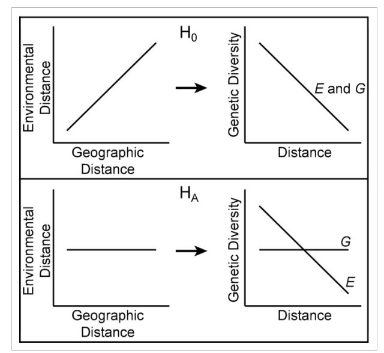
Relaciones hipotetizadas entre la distancia al centro del nicho ecológico, el centro del rango geográfico y la diversidad genética. \
**H0:** La marginalidad ambiental y geográfica coinciden, lo que lleva a que ambas estén negativamente correlacionadas con la diversidad genética. \
**HA:** La marginalidad ambiental y geográfica están desacopladas, lo que da lugar a la falta de relación entre la diversidad genética y la centralidad geográfica.

**Ejemplo con *Lynx rufus***
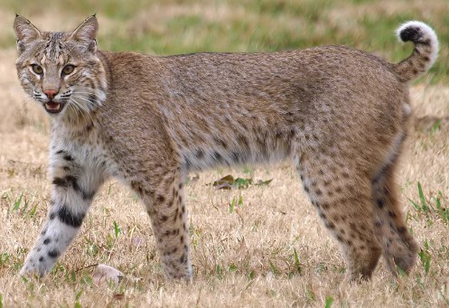

**Distribución geográfica de la variación genética:**
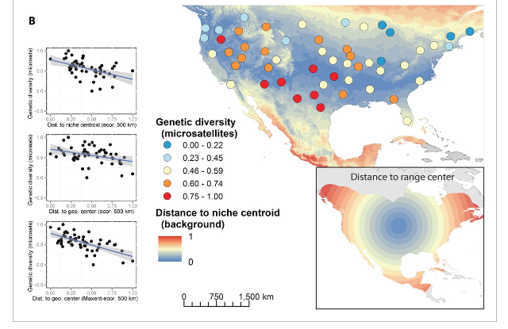
Relaciones entre la diversidad genética y la centralidad en *Lynx rufus*. El panel izquierdo muestra las regresiones lineales entre la diversidad genética y la distancia al centro del nicho o geográfico.

[RELATIONSHIP OF GENETIC DIVERSITY AND NICHE CENTRALITY: A SURVEY AND ANALYSIS (Lira-Noriega & Manthey 2013).](https://onlinelibrary.wiley.com/doi/full/10.1111/evo.12343)

### A nivel morfológico:
**Filogenia**

**Morfología**

**Nicho climático**
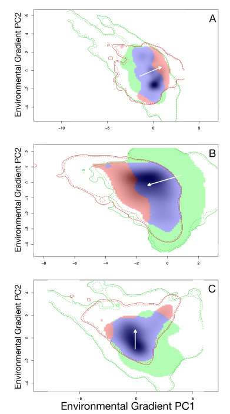

[Environmentally driven phenotypic convergence and niche conservatism accompany speciation in hoary bats (Soto‑Centeno & Simmons 2022).](https://www.nature.com/articles/s41598-022-26453-y)

### Bonus
**Zonas de contacto**
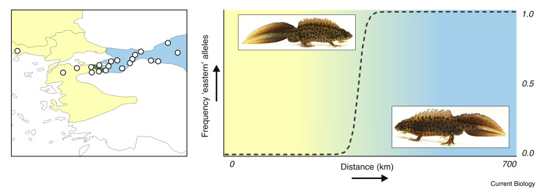
Las zonas híbridas son regiones en las que poblaciones distintas se encuentran, se emparejan y producen descendencia genéticamente mezclada, es decir, híbrida. Por lo tanto, las zonas híbridas ofrecen una visión sobre las barreras genéticas que subyacen al origen de las especies.

[Hybrid zones (Wielstra 2021).](https://www.cell.com/current-biology/fulltext/S0960-9822(20)31758-9?_returnURL=https%3A%2F%2Flinkinghub.elsevier.com%2Fretrieve%2Fpii%2FS0960982220317589%3Fshowall%3Dtrue)

**Modificaciones a nivel **Mitocondrial** - **Fenotípico** - **Genómico** - **Conductual****
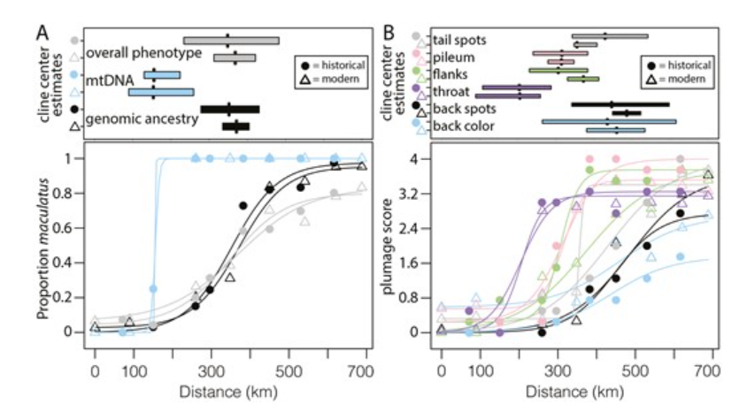
Clinas geográficas que muestran la transición de: \
(A) Caracteres genéticos a lo largo del gradiente TMVB. \
(B) Caracteres Fenotípicos a lo largo del gradiente TMVB. 

[Hybrid zone or hybrid lineage: a genomic reevaluation of Sibley’s classic species conundrum in *Pipilo towhees* (DeRaad et al 2022).](https://onlinelibrary.wiley.com/doi/full/10.1111/evo.12343)

**Práctica 4.6: Comparación de nicho.**

Esta práctica está basada en:
-  [ellipsenm (Marlon Cobos et al 2019)](https://github.com/marlonecobos/ellipsenm).
- [NicheToolBox (Osorio-Olvera et al 2019)](https://github.com/luismurao/ntbox).
- [ntbox (Osorio-Olvera et al 2019)](https://luismurao.github.io/ntbox_user_guide.html).

**Recomendaciones:** 
- [Combining niche shift and population genetic analyses predicts rapid phenotypic evolution during invasion (Sotka et al., 2018).](https://pmc.ncbi.nlm.nih.gov/articles/PMC5978718/)
- [The evolutionary genomics of species’ responses to climate change (Aguirre-Liguori et al., 2021).](https://www.nature.com/articles/s41559-021-01526-9)
- [Niche models at inter‑ and intraspecifc levels reveal
hierarchical niche diferentiation in midwife toads (Rodríguez‑Rodríguez  et al., 2020).](https://www.nature.com/articles/s41598-020-67992-6)
- [Combining niche shift and population genetic analyses predicts rapid phenotypic evolution during invasion (Sotka  et al., 2018).](https://onlinelibrary.wiley.com/doi/10.1111/eva.12592)
